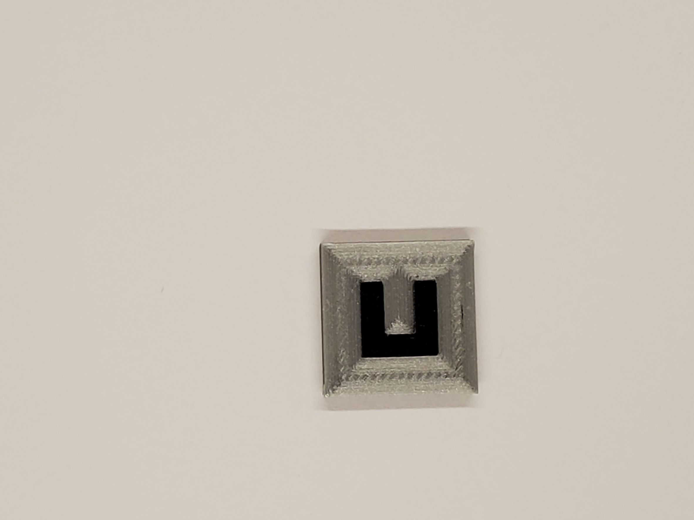
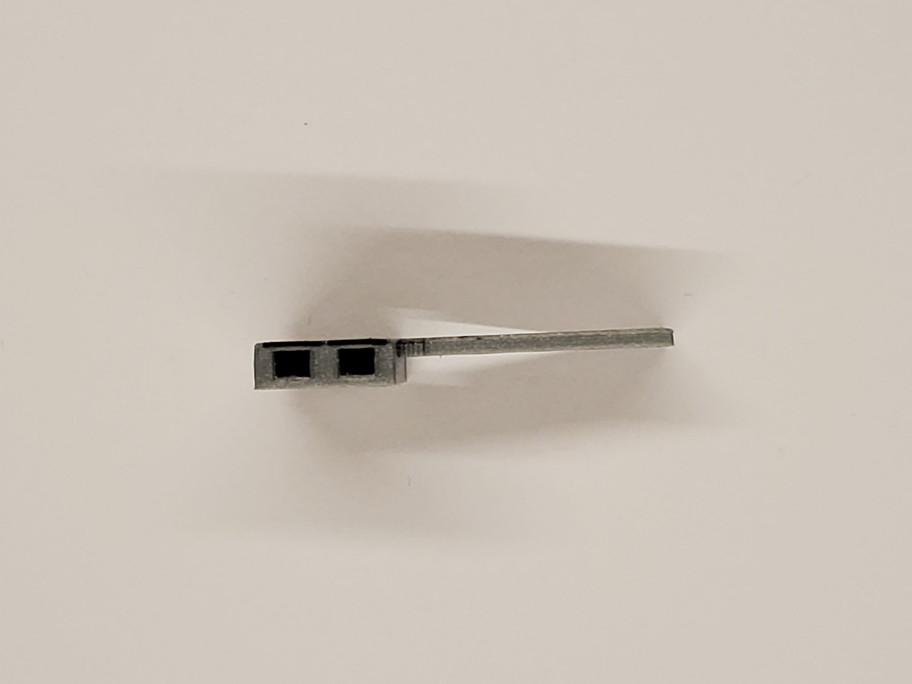
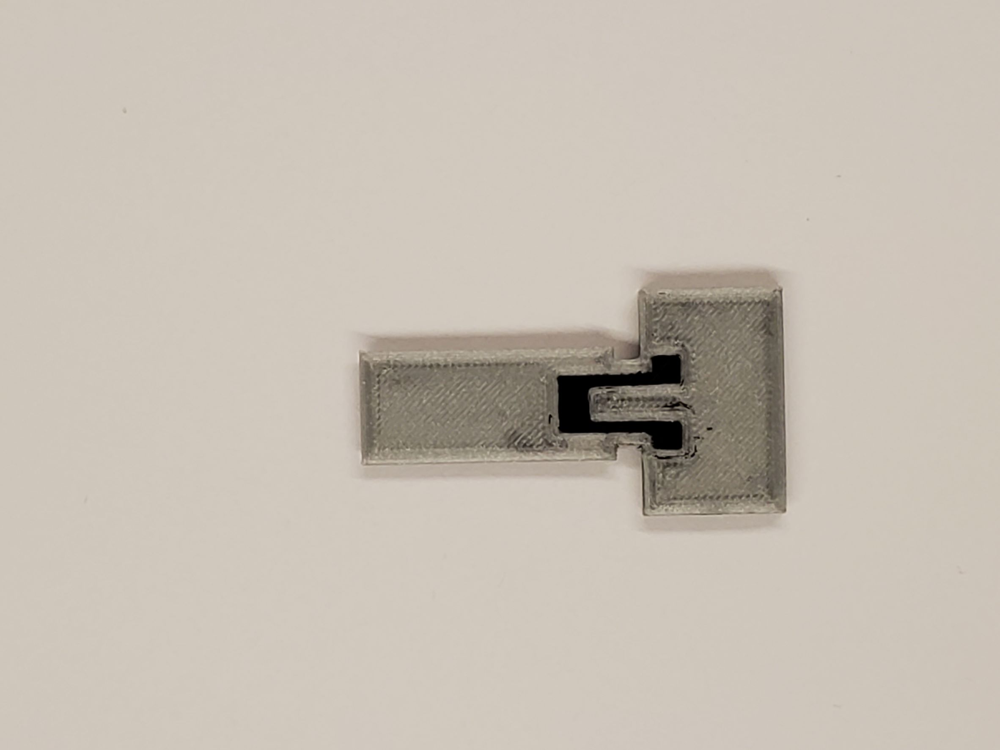
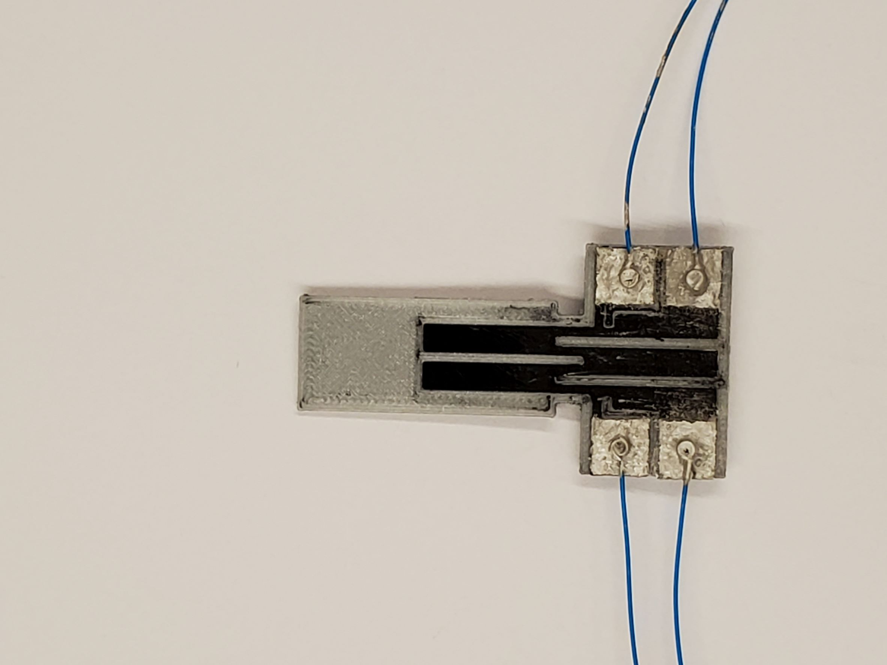

# Sample Images

A 1 cm² capacitance-based sensing component, printed right-side-up (unlike most other Pithon devices) as a parallel plate capacitor:

A resistance test structure: <!--TODO-->

A Pithon strain gauge / force sensor with large electrical contact pads for four-terminal sensing:

Another Pithon strain gauge / force sensor, here with a secondary/reference set of conductive traces to account for different environmental conditions:

An earlier iteration with smaller electrical contact pads and just two lengths of conductive traces as its sensing element:

A variation of the device being resistance-tested under a probe station:

The Pithon strain gauge / force sensor with wires bonded to its contact pads using conductive paint:

